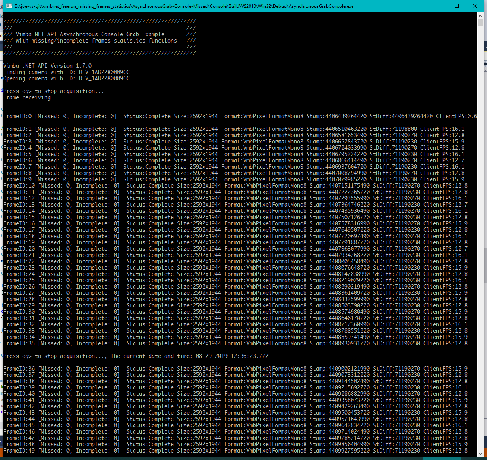

vmbnet_freerun_missing_frames_statistics
---

# 简介

VimbaNET_Examples\AsynchronousGrab-Console Example with missing/incomplete frames counting functions.  
基于VimbaNET_Examples\AsynchronousGrab-Console例程，增加图像接收统计功能。

# 例程使用说明

* FrameID: 自从相机上电运行后，每一张图片都具有一个连续递增的序列号。
* Missed: 已经累积丢失的图片数量。
* Incomplete: 已经累积收到的不完整图片数量。

# 代码及编译  
代码在这里：https://github.com/avtcn/vmbnet_freerun_missing_frames_statistics
